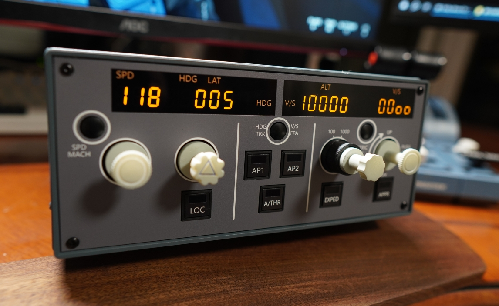
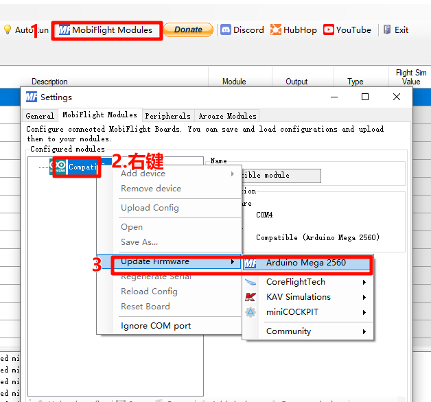
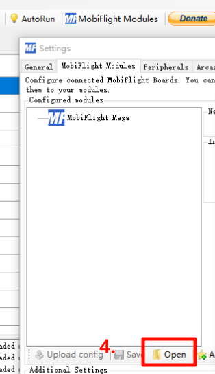
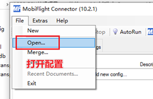
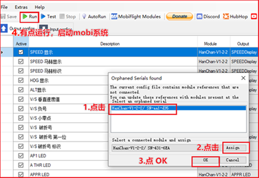

# HanChan-FCU（寒蝉FCU）

## 项目简介

HanChan-FCU（寒蝉FCU）这个是基于MobiFlight固件与Arduino mega2560开发板自制的空客Airbus A320的FCU（飞行控制单元），推拉机械结构参考使用了用户@Santi Luib III。

基于mobiflight固件，所以此项目的FCU能支持配置到市面上几乎所有主流的模拟飞行平台和机型，且硬件维护成本较低，采用金属外壳。

本项目是起因是重新游玩“微软模拟飞行2020”，当时市面上无售价合适性价比较高的空客FCU产品（现在已有几个不错产品），而且中文互联网也没有人分享DIY方案。所以就想到要自己DIY一个FCU产品。

整个项目是本人一个人用业余时间完成的，修改迭代了上百个小版本，无偿分享给飞友。

本人做视频与分享知识的一个目的也是希望提升中文社区的一个技术氛围。能增加中文互联网的开源整体环境，每个人互帮互助。

希望大家之后也能发布相关学习经验 来提高中文网上社区环境。

项目整体介绍视频：[点击此文字](https://www.bilibili.com/video/BV154421D7D3/)

硬件制作教程视频：[点击此文字](https://www.bilibili.com/video/BV18z421q7wh)

讨论群：923213555

## 版权控制

本项目禁止其他任何商业行为，**仅供飞友个人DIY使用。**

如有发现有其他商业使用的行为（包括不限于闲鱼淘宝等），将直接闭源，不再更新。

在粉丝建议下加入，如果非要商用：“商用者即同意条款：将营业额60%作为技术费用付给开源作者本人。”

## 第一次使用教程

### 一、刷入固件教程：

#### 1.按图所示选择先选择 Arduino Mega2560 刷入底层固件。

#### 2.载入固件配置：（固件配置名称 例：HanChan-V1-2-3.mfmc）

### 二、加载mobi配置步骤：

1. **先插入FCU到电脑。**
2. **打开mobi软件并 打开配置**。配置名例：**V1.2.3fenixA320.mcc**

   

   

   
3. **结束配置，以后插入FCU使用点击Run 就可以直接使用FPU了。**

## 项目更新

V1.2.3：
显示模块重置，配置做修改。

V1.2.2：
1.重写了配置文件，完善了功能。
2.面板尺寸修改。减少与金属机箱缝隙。
3.打印面板参考真机样式，小改。

V1.2.1：
1.推拉结构间隙调整，提高手感减小矿量。
2.圆形按钮 卡槽加高深度。按钮突出更合理点。
2.面板UV打印部分做了小修改。

V1.2.0：
1.升级了上面三个圆形按钮的元件选型，继续靠近真机细节。
2.更改了面板布局，整个外面，面板UV打印部分重置重新绘制过了。
3. 3D打印的主体面板，设置设计升级了定位孔，减少胶水粘结部分，改为螺丝连接，更加紧固了。
4.拖拉结构的定位孔进行了细调，用来配合主体面板。

## 支持

如果帮助到大家，欢迎大家捐赠和购买我的配件合集来支持项目的更新与迭代。

闲鱼 直接搜 “寒蝉FCU”或者 “寒蝉唱游”就可以了。

如果有需要[配件打包](https://search.bilibili.com/all?from_source=webcommentline_search&keyword=%E9%85%8D%E4%BB%B6%E6%89%93%E5%8C%85&seid=11503334619153044343)的可以到我闲鱼去看下，先上架了了一个预定包。预定包中的配件除了有各种标准电子原件外，还包涵了市面上没有的各种定制件，包含了12位数码管等，而且有部分喷漆改色打磨服务，还有贴纸面板等。主要是简化了大家的定制的精力。

## 感谢

感谢前期支持迭代，帮忙内测的群友。

@fullofghost   感谢贡献

@紫聪聪         感谢贡献

@Santi Luib III  	模型与机械结构

@L7          		A320真机飞行员 提供真机照片与细节
